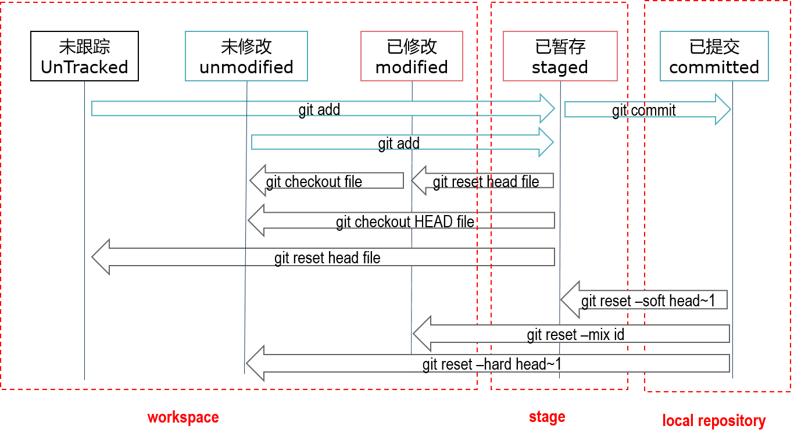

# git-learning

## 仓库说明

本仓库主要用于Git学习和常见问题记录，希望大家能在这里学习到更多的Git知识


# Git基础

​	Git是随着开源项目的流行，逐渐被开发者广泛使用的版本管理工具，Git最早是由linux的作者linus创建于2005年，Git诞生时，就带着小巧、灵活、分布式、多人协作的属性，特别适合多人协作开发，而开源项目都是多人、多地并行开发，所以一般都使用Git作为其版本管理工具，如开源托管平台Github、gitee等都在使用git，而平台的存在，则降低了开发人员使用Git的难度，仓库的创建、管理交由平台托管，开发人员不用考虑项目的空间、设备的安全等，只需要专注开发项目本身即可。


## 使用帮助文档

```
git help
git help xxx
git xxx --help
git xxx -h
```

注：git help和git --help命令效果相同

## Git创建

创建本地仓库：git init

	$git init
	Initialized empty Git repository in E:/temp/Git/.git/

从远程克隆代码：git clone

	$git clone --recursive https://gitee.com/chenpeihua/git-learning.git
	Cloning into 'git-learning'...
	remote: Enumerating objects: 3, done.
	remote: Counting objects: 100% (3/3), done.
	remote: Total 3 (delta 0), reused 0 (delta 0), pack-reused 0
	Unpacking objects: 100% (3/3), done.


## Git仓库

使用git init或者git clone创建本地仓库后，就可以在Git上开发代码了。一旦本地仓库建立，有几个概念就需要了解一下，如下图所示，是关于工作区、暂存区、本地仓库和远程仓库之间命令转换关系 

Git工作区参考下图


* 工作区：目录.git以外的文件

* 暂存区：.git文件中，临时存储修改变更文件的区域

* 本地仓库：存储在本地的仓库文件，Git的大部分操作都是在本地仓库进行的

* 远程仓库：存储在远端服务器的仓库文件


## Git文件状态

Git管理的文件只有三种状态：已暂存（staged）、已提交（committed）、已修改（modified），下图为了更好的描述文件状态转换而增加了几种文件状态，未跟踪状态实际并不在Git管理当中，未修改状态与已提交状态是完全相同的，只是为了区分工作区和本地仓库而使用不同的命名 




## Git 分支

常用命令

* git branch查看本地分支
* git branch -r //查看远程所有分支
* git branch -a //查看本地和远程的所有分支
* git branch <branch-name> //新建分支
* git branch <branch-name> <start-point>//从start-point新建分支
* git branch -d <branch-name> //删除本地分支
* git branch -m <old-branch> <new-branch> //重命名本地分支
* git checkout branch-name //切换分支
* git checkout –b branch-name //创建分支并切换到分支
* git branch -d -r <branch-name> //删除远程分支，删除后还需推送到服务器
* git push origin:<branch-name> //推送至服务器

创建一个Git分支，可以使用如下命令

```
$git branch feature11
$git checkout feature11
```

以上命令创建一个feature11分支，并切换到分支，也可以使用一条命令来替代

```
$git checkout -b feature11
```

当分支内容全部合并到其它分支后，就可以将分支删除了，删除分支命令如下

```
$git branch -d feature11
```


## 撤消和恢复

git rebase

git reset


## Git服务器

GitHub

Gitlab

GitBlit

GitBucker

Gitee

Coding


# 常见问题

